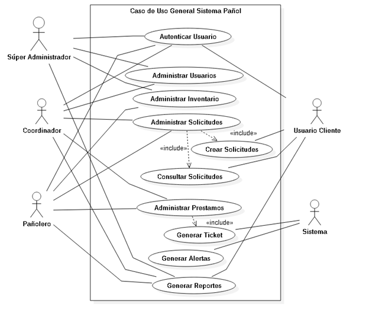

# Problema
Hoy las Escuelas, en general, no disponen de un sistema automatizado para gestionar la asignación o préstamos de materiales, equipo o herramientas. Lo que implica no contar con control eficiente de los préstamos que administra cada Escuela. Se necesita implementar un sistema informático con el criterio de resguardar los materiales y herramientas disponibles para la comunidad docente y alumnos asociados a los préstamos cursados por su dirección o coordinación. Hoy es importante para cada escuela gestionar mejor sus recursos por lo que es necesario contar por ejemplo con un pañol habilitado físicamente en algún punto de la sede que sea eficiente y que evite pérdidas de materiales o recursos. Es necesario que se logre una mejor administración de los préstamos o existencias de materiales y herramientas por medio de un sistema informático más allá de las buenas prácticas que ya se apliquen en la Sede. Se necesita mejorar el proceso de seguimiento, control y devolución de cada recurso asignado a un solicitante alumno o docente. Hoy en las escuelas que ya poseen un pañol o algo similar se evidencia un pobre manejo de la información y baja disponibilidad para ser consultada. Así también existe la imposibilidad de contar con reportes rápidos y fiables sobre aspectos más precisos de cómo se administran los materiales por parte del Jefe de Carrera, coordinador o Pañolero. Por ejemplo informarse oportunamente sobre; Cantidad de Préstamos asociados a un alumno o docente, carrera o asignatura es un debe en el proceso de gestión. Los reportes por categorías por ejemplo; Material, Herramienta o equipo. Alertas que apoyen a su gestión.  Eso entre otros aspectos a evidenciar es inalcanzable con un proceso de registro manual que se necesita automatizar a la medida de su Sede y Escuela.

# Solución necesaria
Se necesita un sistema informático local que funcione para un Pañol que se llegue a habilitar por alguna escuela en su sede que les permita registrar en forma automatizada los préstamos y devoluciones de materiales o herramientas. Se necesita que se optimice el proceso de administración y gestión de las solicitudes en forma rápida y eficiente junto a la gestión de préstamos y su registro de devolución. Además de contar con registros de stock en un inventario, sobre historiales de préstamos y devoluciones asociadas a los usuarios que favorezcan una mejor gestión que faciliten acciones y tomas de decisiones.
Una parte del sistema deberá permitir gestionar a los usuarios e ingresar nuevos usuarios o dar de baja a estos. Tanto Usuarios Administradores como Usuarios Finales. Además se necesita un sistema de administración de inventario que permita ingresar los productos a su stock y que permita clasificar y organizar los recursos en forma eficiente y generar los préstamos y seguimientos.
En este escenario en su sede debe buscar la necesidad de implementar un pañol por parte de su escuela y desarrollar un sistema de pañol a la medida para su Sede y Escuela. Su equipo de Portafolio en conjunto con el docente debe Identificar primero que escuela necesita implementar un Sistema de Gestión de Pañol, definir sus Objetivos y alcances, Desarrollar la aplicación informática y adaptar el sistema a las necesidades de la escuela que su equipo determine como Beneficiario. Debe respetar las características iniciales detalladas más adelante como punto de partida en aspectos funcionales y otras reglas.

# Funcionalidades del producto
Como propuesta solución se debe Desarrollar un sistema de pañol, amigable y usable de acuerdo a los estándares de usabilidad impuestos actualmente por la industria.
A nivel Local debe funcionar en pañol un Sistema de administración de Usuarios, de inventario, solicitudes y préstamos que administre la existencia de los productos (Materiales, Herramientas y Equipos) y gestione solicitudes y préstamos.
Por otro lado debe existir una Aplicación web de Solicitudes on-line que se conecte a la misma base de datos del sistema local de pañol. Esta aplicación web estará disponible para Usuarios Alumnos y Docentes y se debe desplegar en computadores personales, móviles o Tablet y acceder a la información por medio de una Base de Datos centralizada que administre el Sistema de Pañol con toda la Data del sistema.
Los Docentes y alumnos, luego de autenticarse en la aplicación web, puedan consultar la existencia de algún recurso producto o material para posteriormente generar su solicitud que más tarde deberá confirmarse en el sistema de pañol.
Los alumnos y docentes podrán por medio de la aplicación web realizar sólo solicitudes (no son registros de préstamos) y consultar por medio del portal online sobre que recursos se encuentran disponibles en pañol, lo que les permitirá ahorrar tiempo para armar su lista de recursos a solicitar. Así podrá validar la disponibilidad y factibilidad que existe para hacer efectivo el préstamo en pañol cuando se presente a hacer efectivo el préstamo en el sistema local.
Hecha la solicitud el solicitante se debe presentar en pañol y el pañolero buscar la solicitud asociada al alumno como activa por medio de la aplicación local que no ha sido procesada. El sistema local se encontrará disponible en un tótem de atención (Físicamente emplazado en Pañol).  Aquí el usuario retomará su solicitud realizada on-line por el pañolero. En este ambiente de sistema, el el pañolero validará la solicitud haciéndola efectiva y pasando a ser registrada como un préstamo asociado al solicitante, con el detalle de recursos y la fecha, hora de solicitud.

# Proceso de Devolución
Posteriormente al utilizar los recursos el solicitante alumno o docente deberá devolver en ventanilla estos recursos físicamente al pañolero. El pañolero verificará el estado de los materiales como en buen estado u otra opción razonable y registrará la devolución de estos. Si hubiera un recurso faltante en la devolución deberá quedar el registro de su no devolución o una observación de su estado defectuoso. Al no existir retorno de un recurso se debe aplicar automáticamente el descuento del stock original en el inventario de pañol. Posteriormente si existiera alguna reposición se debe registrar el ingreso de recurso y actualizar el stock de inventario.

# REQUERIMIENTOS FUNCIONALES PRINCIPALES
RF.1 El sistema debe permitir autenticar y permitir el ingreso de sus usuarios.

RF. 2 El sistema debe permitir administrar los Usuarios en el Sistema y asignar perfiles, crear usuarios y cargar datos personales. Permitir la alta y baja o modificación de datos.

RF. 3 Debe administrar alumnos y Docentes. Crearlos como usuarios y cargar datos personales. Permitir la alta y baja o modificación de sus datos.

RF. 4 Permitir administrar el inventario de Pañol. Registrar los productos o Recursos de pañol en un inventario controlando su stock y su disponibilidad para los préstamos. Dar de alta y Baja los recursos ingresados en el Inventario.

RF. 5  Crear Solicitudes: Por medio del Sistema Web se debe permitir al alumno o docente crear y guardar en su cuenta una solicitud de uno o varios recursos de Pañol, de sus Productos, equipos, instrumentos o herramientas de trabajo que se necesiten para su actividad a desarrollar en la clase.

RF.6 Consultar y Validar solicitudes: En el Sistema Local el pañolero podrá consultar y validar las solicitudes para posteriormente pasen a ser un registro de préstamo generado al pasarlas a registro de préstamo.

RF. 7 Administrar Solicitudes: El pañolero en el Sistema Local en base a una Solicitud Web de un recurso de pañol realizada por parte de un usuario Alumno o docente, se deberá revisar el detalle de la solicitud, editar la solicitud para validar los recursos reales en stock, marcar los que sean de préstamo disponible en ese momento y luego registrar la solicitud como préstamo.

RF. 8 Registra préstamos y Devoluciones: En el Sistema Local en base a la solicitud anterior se deberá registrar el préstamo en el Sistema de Préstamos. Y en caso de ser devuelto el recurso se registrará su devolución.

RF. 9 Consultar préstamos gestionados en el día por parte del Pañolero o Coordinador con el propósito de verificar su estado como en curso o devuelto.

RF. 9 Generar reportes detallados y útiles para cada uno de los perfiles de Usuarios definidos en el sistema para su toma de decisiones o acción asociada a su rol.

RF.10 Generar Ticket de Respaldo de Préstamos y Devolución a cuentas de Usuarios solicitantes.

RF.11 Entregar Alerta automática de Morosos en pañol a Correo de los usuarios que administran Pañol.

RF.12 Generar alertas automáticas de baja cantidad de productos en stock en pañol.

RF.13 Entregar Reportes detallados útiles para la Gestión de pañol. En Requerimientos de Sistema se detallan su tipo.

RF.14 Bloquear a alumnos morosos para que no puedan generar solicitudes en base a alguna regla por definir en base a tiempo, tipo y cantidad de recursos que se defina en virtud de las necesidades del pañol y la Escuela.

## Casos de uso. 
### Especificación del Caso de Uso

<!-- TODO: Modificar la tabla para que se vea bonito -->

| ID Caso de Uso | Descripción y trazabilidad |Actores  involucrados|
|:-----------:|:-----------:|:-----------:|
| CU1 | Autenticar usuario RF 1 | Jefe Carrera Coordinador Pañolero Alumno|
| CU2 |	Administrar Usuarios; Pañoleros y Coordinadores | RF 2	Jefe Carrera Coordinador |
| Administrar Usuarios Alumnos y Docentes|
RF 3	Jefe Carrera
Coordinador
CU3	Administrar Inventario Pañol
RF 4	Jefe Carrera
Coordinador
Pañolero
CU4	Administrar Solicitudes  a Pañol
RF 7
Alumno
Docente
Crear Solicitudes por medio del Sistema Web
RF 5	Pañolero
Coordinador
Consultar Solicitudes por medio del Sistema Web y de Escritorio
RF 6	Pañolero
Coordinador
Validar y Editar Solicitudes para registrarlas como Préstamo RF 7	Pañolero
Coordinador
Alumno
Docente
CU5	Administrar Préstamos. RF8, RF9	Coordinador
Pañolero
Generar Ticket de Respaldo de Préstamos y Devolución. RF10
Bloquear a alumnos Morosos automáticamente según regla que determine el equipo de desarrollo. RF14	Sistema
CU6	Generar Alertas automáticas de Usuarios Morosos. RF11
Generar Alertas automáticas por déficit de stock. RF12	Sistema
CU7	Generar reportes Detallados. RF 13	Jefe Carrera
Coordinador
Pañolero

# Diagrama de casos de uso

# Características del producto

En el sistema Local el Pañolero revisa la solicitud generada por el alumno, confirma la solicitud de acuerdo al material disponible y genera finalmente el préstamo con su registro respectivo lo que genera un ticket al Solicitante con el detalle del préstamo a su cuenta de correo y/o en su cuenta de Sistema Pañol.

El ticket del préstamos será digital en formato Pdf para permitir su impresión y deberá contener su propia ID basada en un registro Correlativo automático que se genere en base al préstamo. La devolución del producto se realizará en base a la búsqueda del préstamo por nombre de usuario o de la ID del préstamo y al registrar su devolución como aceptada se genera un mensaje de texto al correo del usuario Alumno o Docente que es dueño de dicho ticket de préstamo.

Los préstamos sólo pueden ser sólo por el día. No obstante si la escuela lo requiere existe la excepción de validar más de un día de préstamo como “Solicitud Especial” que será validada por el Jefe de Carrera o su coordinador y pasará a poseer un nuevo tipo como “Préstamos especial”. El Administrador del préstamo especial definirá los días máximos de préstamo posibles como máximo que deberán ser administrables o parametrizables.

El pañolero podrá generar una solicitud a nombre de un alumno relacionándola al RUT de éste si es que el alumno se ve imposibilitado para realizarla por sí mismo la acción de Solicitud por imponderables como por ejemplo problemas de accesibilidad (Discapacidad o imposibilidad tecnológica, bajo nivel de desconocimiento de los recursos que requiere y debe ser asesorado en la solicitud).

Se deben crear perfiles de Usuarios dentro del Sistema que como mínimo serán los siguientes:

•	Usuario Súper Administrador (Asociado al  Jefe de Carrera)

•	Usuario Pañolero (Asociado al encargado de Pañol)

•	Usuario Coordinador de Carrera (Asociado a un coordinador de confianza del Jefe)

•	Usuario Docente: Asociado a docentes que pertenecen a la Escuela y Carrera a la que pertenece pañol.

•	Usuario Alumno: Asociado a alumnos que pertenecen a la Escuela y Carrera a la que pertenece pañol.

## Requisitos Específicos de Sistema y Alcances

#### Sistema

RS.1 Generar Alertas automáticas al pañolero de nivel bajo de stock de recursos en base a los criterios Normal, Bajo, Crítico.

RS.2 Generar Ticket de respaldo con el detalle de los préstamos en forma automática a los usuarios solicitantes en base al detalle desarrollado en el registro del préstamo que se debe basar en el contenido del formulario solicitud.

RS.3 Validar la autenticación de los usuarios que ingresen a los sistema de Pañol y asociarlo a un inicio de sesión por nombre y rol. Ejemplo: “Bienvenido; Esteban Solis”.  “Usuario Alumno”

RS.4 Cerrar la sesión automáticamente si permanece abierta sin actividad por más de 5 minutos para todos los perfiles excepto para el Usuario Pañolero.

#### Usuario Súper Administrador (Jefe de Carrera) podrá en el sistema local:

RS. 1 Crear nuevos Usuarios según los perfiles detallados anteriormente (No podrá crear perfiles ajenos a estas categorías por medio del administrador).

RS.2 Dar de Baja o Modificar la información de usuarios. No se pueden borrar los Usuarios de la BD.

RS. 3 Administrar y dar de baja productos por renovación de inventario y cantidad de stock. No se puede borrar un recurso del inventario sólo dar de baja.

RS. 4 Generar reportes generales y detallados que sean útiles para la toma de decisiones del Jefe de Carrera. Mínimo;

    - Reporte General de todo el Stock disponible y no disponible actualmente.
    - Reporte de Recursos más solicitados y lo menos solicitados,
    - Reporte específicos; Reporte de Devoluciones fuera de plazo por Recurso y usuario.
    - Reporte de los recursos que registran más pérdidas o dadas de baja.

#### Usuario Coordinador de Carrera podrá en el sistema local;

Atributos habituales:

RS.1 Ingresar al Sistema a los Usuarios Alumnos en forma individual por medio de una interfaz gráfica de administrador

RS.2 Que el sistema permita importar y cargar una DATA mínima inicial en la base de datos de Usuarios Alumnos en forma masiva que se encuentre recopilada en un archivo en formato Excel o Access que posea los siguientes campos:

|Rut | Apellido 1| Apellido 2|Nombre 1|Carrera |Teléfono| Correo Alumno |
Nota: Al cargar los usuarios se genera la clave del usuario automáticamente, siendo el identificador de usuario su RUT.

RS.3 Bloquear o desbloquear a usuarios por permanecer morosos a pesar de que cuenten con alguna morosidad registrada en el sistema con un campo de texto que explique en detalle el motivo cuando el usuario genere una solicitud.

RS.4 Generar reportes con los mismos atributos del Jefe de Carrera.

#### Usuario Pañolero podrá en el sistema local:

RS.1 Ingresar productos al sistema de inventario por medio de interfaz gráfica que permita además, modificar y darlos de baja catalogándolos según las categorías dispuesta por el sistema:

|ID Producto| Nombre | Categoría | Detalle| Cantidad | Imagen|

- Es sólo una Imagen asociada al producto y no debe exceder los 150x100 pixeles de tamaño.

- El archivo de cada imagen de producto No debe pesar más de 120 kb.

RS.2 Desde la aplicación local; Ver reportes diarios de reservas on-line sobre recursos solicitados por los usuarios en el Portal Web que estos disponen.

RS.3 Editar la solicitud y registrar el préstamo que se generará a los alumnos y Docentes que se presenten en ventanilla a retirar materiales.

RS.4 Dar de Baja o anular préstamos asignados a un usuario que no hace efectiva la solicitud si fuera necesario. Debe quedar registrado que pañolero asigna un préstamo al solicitante.

RS.5 Ver reportes de estado de préstamos igual que un coordinador.

RS.6 Bloquear a usuarios registrados directamente a alumnos morosos por algún motivo administrativo o particular. No podrá bloquear las cuentas de usuarios de Docentes o de Jefes de Carrera.

#### Usuario Docente y Alumno

RS.1 Podrá crear una solicitud en el sistema web con el detalle de los recursos a retirar como préstamo en pañol.

RS.3 Consultar y ver su historial de solicitudes y préstamos asignados a su cuenta.

Observación:   Se emite automáticamente al Usuario que recibe un préstamo un ticket digital con el detalle del préstamo. Se emite además un ticket de la devolución aceptada a su cuenta de usuario personal o a su correo como respaldo de la devolución.